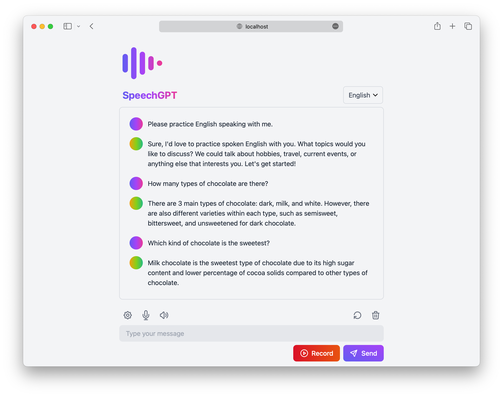
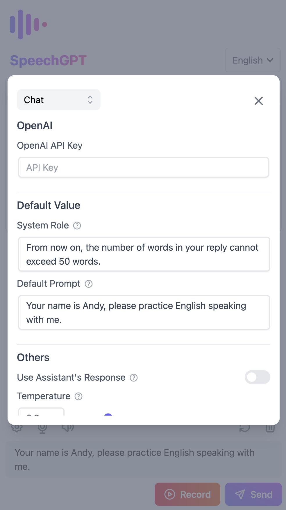
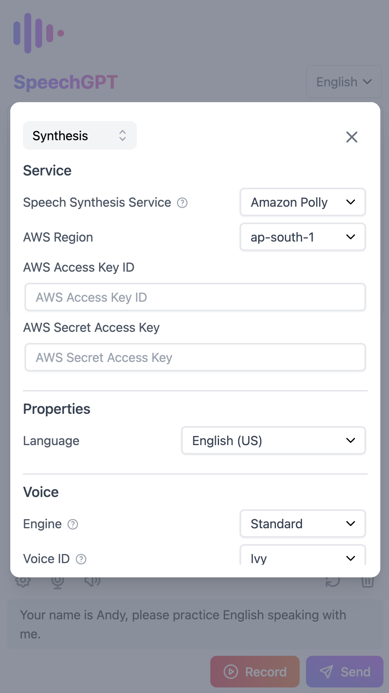

<p align="center">
  <a href="https://speechgpt.app"></a>
</p>

<p align="center">
  <a href="https://speechgpt.app/">Website</a> •
  <a href="https://github.com/hahahumble/speechgpt/blob/main/docs/README.zh.md">[中文]</a>
</p>

<p align="center">
  
</p>

## Introduction
SpeechGPT is a web application that enables you to converse with ChatGPT.</br>
You can utilize this app to improve your language speaking skills or simply have fun chatting with ChatGPT.

## Features
- 📖 **Open source and free**: Anyone can use, modify it without cost.
- 🔒 **Privacy First**: All data is stored locally.
- 📱 **Mobile friendly**: Designed to be accessible and usable on mobile devices.
- 📚 **Support for multiple languages**: Supports over 100 languages.
- 🎙 **Speech Recognition**: Includes both built-in speech recognition and integration with Azure Speech Services.
- 🔊 **Speech Synthesis**: Includes built-in speech synthesis, as well as integration with Amazon Polly and Azure Speech Services.

## Screenshots
<table>
  <tr>
    <td></td>
    <td></td>
    <td></td>
  </tr>
</table>

## Tutorial
1. Set the OpenAI API Key <br/>
    - Go to Settings and navigate to the Chat section.
    - Set the OpenAI API Key.
    - If you don't have an OpenAI API Key, follow this tutorial on [how to get an OpenAI API Key](https://www.windowscentral.com/software-apps/how-to-get-an-openai-api-key).
2. Set up Azure Speech Services (optional)
    - Go to Settings and navigate to the Synthesis section.
    - Change the Speech Synthesis Service to Azure TTS.
    - Set the Azure Region and Azure Access Key.
3. Set up Amazon Polly (optional)
    - Go to Settings and navigate to the Synthesis section.
    - Change the Speech Synthesis Service to Amazon Polly.
    - Set the AWS Region, AWS Access Key ID, and Secret Access Key (the Access Key should have the AmazonPollyFullAccess policy).
    - If you don't have an AWS Access Key, follow this tutorial on [how to create an IAM user in AWS](https://www.techtarget.com/searchcloudcomputing/tutorial/Step-by-step-guide-on-how-to-create-an-IAM-user-in-AWS).

## Development
1. Install dependencies.
```bash
yarn
```

2. Start development server.
```bash
yarn dev
```

3. Build for production.
```bash
yarn build
```

Code formatting(Using Prettier).
```bash
yarn format
```

##  Build and Run With Docker
1. Build the image.
```bash
docker build -t speechgpt .
```
2. Run the container.
```bash
docker run -d -p 8080:8080 --name=speechgpt speechgpt
```
3. Visit `http://localhost:8080/`.
4. Enjoy!

## License
This project is licensed under the terms of the [MIT license](/LICENSE).
