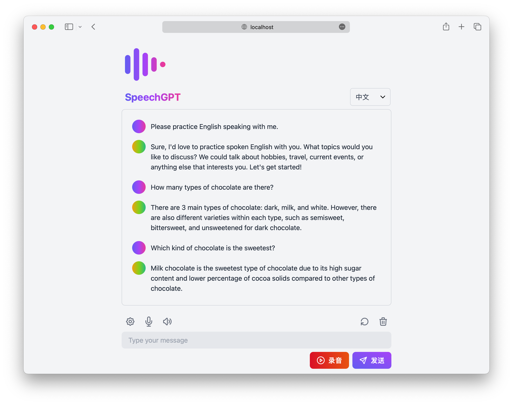
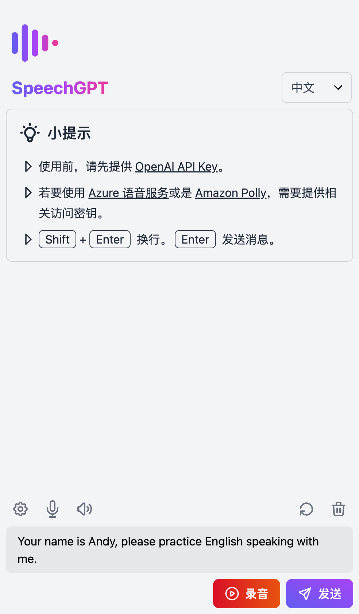
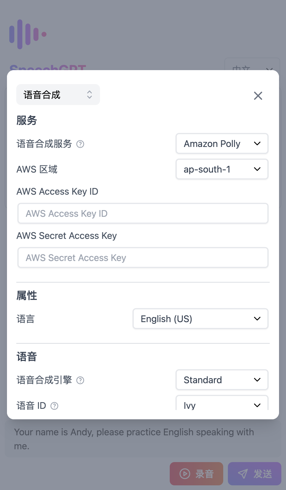
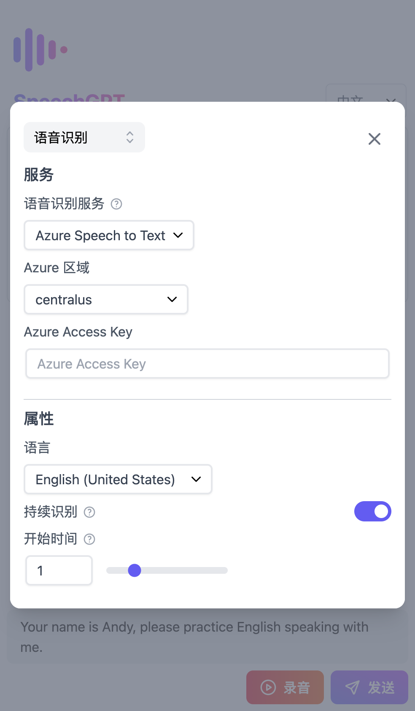

<p align="center">
  <a href="https://speechgpt.app"></a>
</p>

<p align="center">
  <a href="https://speechgpt.app/">网站</a>
</p>

<p align="center">
  
</p>

## 🌟 简介
SpeechGPT 是一个让你与 ChatGPT 聊天的网站。<br/>
你可以使用 SpeechGPT 来练习你的口语，或者只是和 ChatGPT 闲聊。

## 🚀 特点
- 📖 **开源免费**: 任何人都可以免费使用、修改。
- 🔒 **隐私至上**: 所有数据都存储在本地，保护用户隐私。
- 📱 **移动端友好**: 具有响应式设计。
- 📚 **支持多种语言**: 支持超过 100 种语言。
- 🎙 **语音识别**: 包括浏览器内置的语音识别功能和与 Azure 语音服务的集成。
- 🔊 **语音合成**: 包括浏览器内置的语音合成功能，以及与 Amazon Polly 和 Azure 语音服务的集成。

## 📸 屏幕截图
<table>
  <tr>
    <td></td>
    <td></td>
    <td></td>
  </tr>
</table>

## 📖 教程
1. 设置 OpenAI API Key <br/>
    - 进入设置，进入对话部分。
    - 设置 OpenAI API Key。
    - 如果您没有 OpenAI API Key，请按照[如何获取 OpenAI API Key 的教程](https://www.windowscentral.com/software-apps/how-to-get-an-openai-api-key)进行操作。
2. 设置 Azure 语音服务（可选）
    - 进入设置，进入语音合成部分。
    - 将语音合成服务更改为 Azure TTS。
    - 设置 Azure 区域和 Azure 访问密钥。
3. 设置 Amazon Polly（可选）
    - 进入设置，进入语音合成部分。
    - 将语音合成服务更改为 Amazon Polly。
    - 设置 AWS 区域、AWS 访问密钥 ID 和密钥访问密钥（访问密钥应具有 AmazonPollyFullAccess 策略）。
    - 如果您没有 AWS Access Key，请按照[如何在 AWS 中创建 IAM 用户的教程](https://www.techtarget.com/searchcloudcomputing/tutorial/Step-by-step-guide-on-how-to-create-an-IAM-user-in-AWS)进行操作。

## 💻 开发指南和更新日志
- 如需了解有关设置开发环境的更多信息，请查看我们的[开发指南](./developer-guide.zh.md)。
- 若要查看项目的重要更改历史，请查阅[更新日志](../CHANGELOG.md)。

## 🚢 部署
### 使用 Vercel 部署
[](https://vercel.com/new/clone?repository-url=https%3A%2F%2Fgithub.com%2Fhahahumble%2Fspeechgpt&env=VITE_OPENAI_API_KEY,VITE_OPENAI_HOST,VITE_AWS_REGION,VITE_AWS_ACCESS_KEY_ID,VITE_AWS_ACCESS_KEY,VITE_AZURE_REGION,VITE_AZURE_KEY&envDescription=If%20you%20do%20not%20want%20to%20provide%20a%20value%2C%20use%20REPLACE_WITH_YOUR_OWN.&project-name=speechgpt&repository-name=speechgpt)

### 使用 Docker 部署
1. 拉取 Docker 镜像
```bash
docker pull hahahumble/speechgpt
```

2. 运行 Docker 容器
```bash
docker run -d -p 8080:8080 --name speechgpt hahahumble/speechgpt
```

3. 访问 `http://localhost:8080/`

### 构建和运行 Docker 镜像
1. 构建 Docker 镜像
```bash
docker build -t speechgpt .
```

2. 运行 Docker 容器
```bash
docker run -d -p 8080:8080 --name=speechgpt speechgpt
```

3. 访问 `http://localhost:8080/`

## 📄 许可
本项目根据 [MIT 许可证](/LICENSE) 的条款进行许可。
